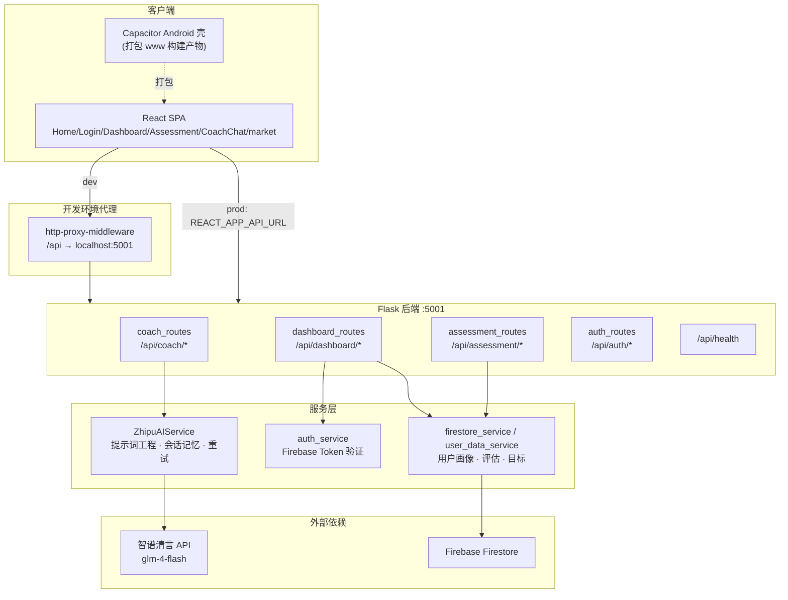

# 财赋思（CaiFuSi）项目评审

> 评审对象：CaiFuSi —— AI 金融心智教练
> 评审日期：2026-09-01
> 评审范围：`main` 分支代码（前端 + 后端 + 移动壳 + 文档）
> 评审性质：技术评审（项目认知 / 技术栈 / 架构分析 / 风险与建议）

---

## 一、项目基本认知

### 1.1 项目定位

财赋思是一款**基于生成式 AI 的金融心智教练应用**，面向青年群体，聚焦用户在消费、储蓄、投资与风险认知中的非理性行为问题，尝试构建「评估 — 分析 — 引导 — 成长」的一体化服务闭环。

与传统记账/交易类工具不同，项目的核心价值主张是：**不只管理"钱"，更引导"心智"**——以行为金融学为理论支撑，以 AI 对话为交互载体，帮助用户建立健康的金钱观、风险观与长期财务习惯。项目同时具有教育传播与社会普惠属性（金融素养教育），属于大学生创新创业训练计划（大创）项目。

### 1.2 目标用户与核心价值

| 维度 | 说明 |
|---|---|
| 目标用户 | 青年群体（消费诱惑多、理财认知尚不成熟） |
| 核心痛点 | 冲动消费、从众投资、损失厌恶、过度自信等行为金融偏差 |
| 价值主张 | AI 教练式对话 + 个性化画像 + 沉浸式体验，把抽象的金融知识转化为可交互、可陪伴的成长过程 |

### 1.3 功能全景

| 模块 | 状态 | 说明 |
|---|---|---|
| 首页 / 信息页 | ✅ 可用 | 团队、联系我们、项目历史、知识科普、FAQ、教程、法律条款 |
| AI 教练对话（CoachChat） | ✅ 核心功能可用 | 基于智谱 GLM 的多轮对话，支持 Markdown 富文本渲染、打字机特效、评估结果个性化注入 |
| 财务心智评测（Assessment） | ✅ 可用 | 10 维度量表（储蓄、风险、应急、债务、知识、收入、目标、追踪、保险、压力），满分 40 分，支持历史趋势 |
| 仪表盘（Dashboard） | ⚠️ 部分 mock | 财务健康度、目标管理、预算、交易记录，部分数据为模拟数据 |
| 行情页（market） | ⚠️ mock 数据 | 新增页面，当前为演示数据 |
| 登录 / 注册 | ⚠️ mock | 前端为 localStorage 模拟认证，Firebase 认证链路未完全接通（详见 3.5） |
| 移动端 | ⚠️ 壳工程 | Capacitor Android 壳，`www` 构建产物需与前端最新构建同步 |

### 1.4 项目阶段判断

项目处于 **Alpha 演示阶段**：核心 AI 对话链路已贯通、产品形态完整、文档体系齐全（策划书 / 技术报告 / 说明书 / 部署指南），但**数据真实性、认证安全性、生产可部署性**尚未闭环，距离可公开运营仍有距离。

---

## 二、技术栈

### 2.1 技术栈总览

| 层次 | 技术选型 |
|---|---|
| 前端框架 | React 18.2（Create React App / react-scripts 5.0.1） |
| 路由 | react-router-dom 6.30（Hash 路由适配 GitHub Pages） |
| UI 体系 | Bootstrap 5.3 + react-bootstrap 2.10 + Tailwind CSS 3.2 混用，animate.css、typed.js/react-typed 打字特效 |
| 富文本渲染 | react-markdown 10 + remark-gfm + rehype-raw + react-syntax-highlighter（AI 回复 Markdown 渲染） |
| HTTP 客户端 | axios 1.3（拦截器）+ 原生 fetch（AbortController 超时）双通道 |
| 前端 Firebase | firebase 11.8（JS SDK，暂未全面启用） |
| 开发代理 | http-proxy-middleware 3（CRA `setupProxy.js`，pathFilter 匹配 `/api`） |
| 后端框架 | Python + Flask 3.0 + flask-cors 4.0 |
| AI 能力 | 智谱 AI SDK（zhipuai 2.1.5），模型 `glm-4-flash`；预留 google-generativeai（Gemini 可选） |
| 数据存储 | Firebase Firestore（firebase-admin 6.5），开发模式内存兜底 |
| WSGI 服务器 | 开发 `app.run`（:5001）/ 生产 gunicorn 21.2 |
| 移动端 | Capacitor 8（@capacitor/android）壳工程 |
| 部署形态 | GitHub Pages 前端演示 + Flask API 独立部署，CORS 白名单含 Pages 域名 |

### 2.2 前端要点

- 单页应用，入口 [App.js](src/App.js) 统一管理路由：公开路由（首页 / 登录 / 注册 / 行情 / 信息页）+ `ProtectedRoute` 受保护路由（仪表盘 / 评测 / 教练）。
- 状态管理轻量：仅 [AuthContext](src/contexts/AuthContext.js) 一个 Context，未引入 Redux/Zustand——对当前规模合理。
- 深色主题改版（全局深色 UI + 粒子背景 + 移动端样式 [mobile-styles.css](src/mobile-styles.css)），视觉完成度较高。
- 网络层有独立封装：[api.js](src/services/api.js) 实现了 30s 超时（AbortController）、自动重试（最多 2 次、线性退避）、友好错误提示（区分超时 / 断网 / 5xx）。

### 2.3 后端要点

- 应用工厂模式：[backend/app/\_\_init\_\_.py](backend/app/__init__.py) 中 `create_app()`，蓝图按业务域注册：`/api/coach`、`/api/dashboard`、`/api/assessment`、`/api/auth`，另提供 `/api/health` 健康检查。
- 配置集中：[config.py](backend/app/config.py) 全部从环境变量读取（`SECRET_KEY`、`ZHIPUAI_API_KEY`、`GEMINI_API_KEY`、Firebase SDK 路径），仓库内无硬编码密钥。
- 健壮性设计：蓝图导入失败时逐级降级（备选导入路径 → Mock 服务），单模块故障不会拖垮整个应用；AI 调用带重试与超时分类报错。

---

## 三、架构分析

### 3.1 总体架构



### 3.2 前端架构

- **分层**：pages（页面）→ components（Layout / MobileNavBar / ParticleBackground）→ services（api.js 网络层）→ contexts（AuthContext 全局认证状态），职责边界清晰。
- **AI 对话页**是完成度最高的页面：输入 → `sendMessageToCoach()` → 携带 `message / user_id / chat_history / assessment_results` → 后端 → Markdown 渲染 + 代码高亮 + 打字机流式观感。

### 3.3 后端架构

- **应用工厂 + 蓝图**：模块化程度好，新增业务域只需注册新蓝图；异常降级设计（真实服务 → 备用导入 → Mock）保证演示环境可启动，但也带来一定的复杂度与维护成本。
- **AI 教练链路**（核心链路）：
  1. 接收 POST `/api/coach/chat`（用户消息 + 前端历史 + 可选评估结果）；
  2. `ZhipuAIService` 组装系统提示词——固定人格设定（专业 / 友好 / Markdown 输出规范）+ **评估结果动态注入**（总分、强项弱项、个性化建议方向）；
  3. 携带最近 6 条历史调用 `glm-4-flash`（temperature 0.7 / top_p 0.9），失败重试 2 次；
  4. 过滤模型输出的 `<think>` 思考标签，规范化空行后返回。
- **会话记忆**：`chat_history` 字典按 `user_id` 在**进程内存**中维护，每用户上限 6 条消息、总上限 12 条。重启即失、多进程（gunicorn）下不共享——演示可用，生产不可靠。
- **评测链路**：问卷提交 → 计算总分与 10 维分类得分 → 生成建议 → 存档（Firestore / 内存兜底）→ 供教练对话引用形成个性化闭环。这个「先画像、后对话」的设计是项目的核心差异化点。

### 3.4 数据流

```
用户填评测问卷 → assessment_routes 打分+建议 → Firestore(或内存兜底)
                                              ↓
用户进入 AI 教练 → 携带评估结果 → 系统提示词注入 → GLM 个性化回复
                                              ↓
对话历史 → 服务端内存缓存(最近6条) → 下一轮上下文
```

### 3.5 认证与安全现状（评审重点）

| 层 | 现状 | 评估 |
|---|---|---|
| 前端 | [AuthContext](src/contexts/AuthContext.js) 为 **localStorage mock**：登录/注册直接生成 `dev-user-*` 用户，不调用任何真实认证 | 演示可用；README 宣称的 Firebase 认证实际未接通 |
| 后端 | dashboard 等接口有 `authenticate` 装饰器：`DEV_MODE` 直通测试用户；否则走 `verify_firebase_token` | 存在安全兜底逻辑（见下） |
| 兜底逻辑 | firebase-admin 导入失败（Python 3.14 兼容问题）时，`auth_service.py` 会**手动解码 JWT 载荷且不验签**，解析失败直接返回 mock 用户 | ⚠️ 任何伪造 token 都可通过认证——演示环境可接受，上线前必须关闭该路径 |
| 密钥管理 | 全部环境变量化，`.env` / `.env.local` / `.env.example` 并存，后端只读根目录 `.env` | 无硬编码，但多份 env 文件并存易混淆，`.env` 若提交即泄露 |

---

## 四、值得肯定的亮点

1. **产品立意好**：「AI 金融心智教练」定位差异化明显，把 AI 用在认知引导而非记账工具上，具备社会价值叙事。
2. **提示词工程质量高**：人格设定、Markdown 输出规范、评估结果结构化注入、强项弱项自动归类，是全书技术含量最高的部分之一。
3. **网络健壮性**：前后端均有超时 / 重试 / 友好错误处理，AI 调用失败有降级路径。
4. **工程安全意识有基础**：无硬编码密钥、CORS 白名单、健康检查、蓝图降级。
5. **文档体系完整**：策划书、技术报告、说明书、部署指南、安全配置文档齐全，对评审与接手者友好。
6. **视觉与交互完成度高**：深色主题、粒子背景、打字机效果、移动端适配、Markdown 富文本渲染。

## 五、问题与风险

### P0（上线前必须解决）
- **认证为 mock**：前端 localStorage 假认证 + 后端 JWT 不验签兜底，任何人可伪造身份访问接口；Firebase Auth 需真正接通并移除不安全兜底。
- **密钥暴露风险**：`.env` 与 `.env.local` 是否在 `.gitignore` 覆盖范围内需确认；若任何真实密钥曾提交过历史，必须轮换。

### P1（影响功能完整性）
- **大量 mock 数据**：Dashboard、行情页的核心数据为模拟数据，业务闭环未真正打通。
- **会话记忆不可靠**：进程内存存储，重启丢失、多 worker 不共享；建议接 Redis 或 Firestore。
- **API 客户端双体系**：`api.js` 中 axios 实例与 `fetchApi` 并存、两套重试逻辑叠加，维护成本高且行为难预测。

### P2（工程卫生）
- **遗留代码**：`backend/routes/`、`backend/services/` 与 `backend/app/routes/`、`backend/app/services/` 存在重复实现（coach_routes、zhipuai_service）；`app/` 下保留 `models_20250609_214957` 等日期后缀备份目录；根目录 4 个 run 入口（run.py / run_dev.py / run_dev_enhanced.py / run_dev_fixed.py）职责不清。
- **调试代码残留**：`App.js` 中 API 状态检查被注释禁用（"临时禁用，用于调试"）；`api.js` 中 GitHub Pages 环境返回占位地址 `https://你的API服务器地址`。
- **移动端构建过期**：Capacitor `www` 构建产物早于最新前端代码，需重建并建立构建流水线。

## 六、改进建议

| 优先级 | 建议 |
|---|---|
| 短期 | 接通 Firebase Auth（前端 SDK + 后端验签），删除 localStorage mock 与 JWT 不验签兜底；将 Dashboard/行情页接入真实数据源；统一 `api.js` 为单一客户端 |
| 中期 | 会话记忆迁移至 Redis/Firestore；清理后端遗留目录与重复实现，固定单一启动入口；为评测与教练接口补测试用例 |
| 长期 | 建立 CI/CD（前端构建 → Capacitor 打包 → 后端部署）；接入监控与日志聚合；评估结果与对话数据的合规与隐私设计（金融建议场景） |

---

## 结语

财赋思是一个**立意好、完成度可观、技术链路已跑通**的学生创新项目：AI 教练 + 心智评测的产品闭环设计清晰，提示词工程与网络健壮性是技术上的真实亮点。当前主要短板集中在「真实性」与「安全性」——mock 数据与 mock 认证支撑了演示，也掩盖了生产差距。补齐认证与数据闭环后，项目具备从课堂作品走向真实产品的基础。
